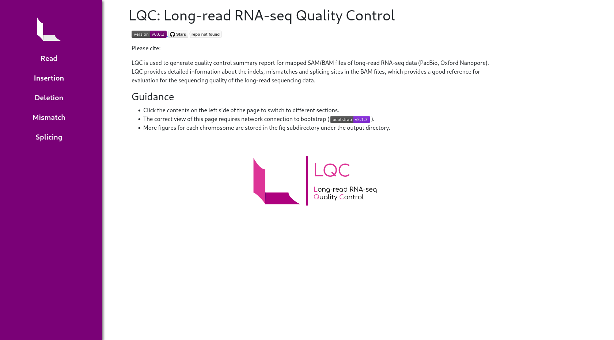

# LQC: Long-read RNA-seq Quality Control

[](https://pypi.org/project/lqc/)
[](https://img.shields.io/badge/license-GPLv3%2B-green)

The Long-read RNA-seq quality control software.

LQC is used to generate quality control summary report for mapped
SAM/BAM files of long-read RNA-seq data (PacBio, Oxford Nanopore). LQC
provides detailed information about the indels, mismatches and
splicing sites in the BAM files, which provides a good reference for
evaluation for the sequencing quality of the long-read sequencing
data.

Please cite us:


## Dependencies

[](https://www.python.org/)
[](https://numpy.org)
[](https://matplotlib.org/)
[](https://pysam.readthedocs.io)
[](https://getbootstrap.com/)

The LQC software was developed with python3, which demands several
python packages.

* [python3.6+](https://www.python.org/): with os, sys, argparse, re,
  functools, collections, multiprocessing, shutil.
* [numpy](https://numpy.org): 1.10+
* [pandas](https://pandas.pydata.org): 1.0+
* [matplotlib](https://matplotlib.org/): 2.0+
* [pysam](https://pysam.readthedocs.io): 0.16+

[Bootstrap 5.1.3](https://getbootstrap.com/) is used by the final html report. Network access is
required to load the css file.

## Installation

It's advised to install the software into a virtual environment.

Create virtual environment:

```{bash}
conda create -n lqc
conda activate lqc
```

Or:

```{bash}
virtualenv ~/.env/lqc
source ~/.env/lqc/bin/activate
```

### From github

Download from github:

```{bash}
git clone https://github.com/gxiaolab/LQC
cd LQC
```

Install the package:

```{bash}
python setup.py install
```

### From pip

```{bash}
pip install lqc
```

## Usage

LQC accepts SAM or BAM file with cs tag (generated with --cs options
by minimap2), or MD tag. If the SAM/BAM file has only MD tag, a genome
fasta reference file is required as well to get the splicing
information. Since cs tag included the splicing site information, a
genome fasta reference is not required by SAM/BAM with cs tag.

```{bash}
usage: lqc [-h] -b BAM_FILE [--genome-fasta GENOME_FASTA] [-o OUTPUT_DIR] [--output-cs]
           [--output-pickle] [-c [CONTIG ...]] [-t THREAD] [--log-level LOG_LEVEL] [--version]

The Long-read RNA-seq quality control software.

optional arguments:
  -h, --help            show this help message and exit
  -b BAM_FILE, --bam-file BAM_FILE
                        input bam file, with cs tags, sorted and indexed
  --genome-fasta GENOME_FASTA
                        path of genome fasta file
  -o OUTPUT_DIR, --output_dir OUTPUT_DIR
                        directory to store output files
  --output-cs           output processed cs tags
  --output-pickle       output pickle file of results
  -c [CONTIG ...], --contig [CONTIG ...]
                        contigs to be analyzed
  -t THREAD, --thread THREAD
                        threads to be used in calculation
  --log-level LOG_LEVEL
                        logging level (default INFO): [DEBUG, INFO]
  --version             show program's version number and exit
```

The output directory should be empty to allow the storage of output
files.

## Output

By default, four kinds of output files will be generated by LQC:
summary table, figures, html report, and pickle file to restore python
statistic objects. And with the `--output-cs` option, the processed cs
tag information of the BAM file will also be outputed. Similarly, with
the `--output-pickle` option, the result objects will be outputed into
one pickle file, which can be used for further analysis.

Summary table will be stored in the table subdirectory of the output
directory. Figures will be stored in the fig subdirectory of the
output directory.

Processed cs tag file has six columns: read name, contig, low, high,
cs mark, cs value.

The LQC will also generate a html report for checking of the BAM file
qualities.

Screenshot of LQC report:


